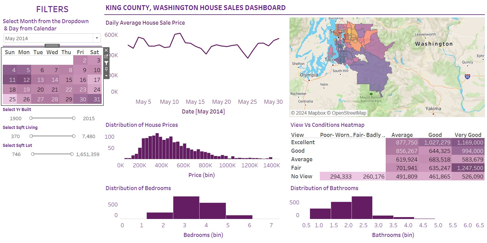
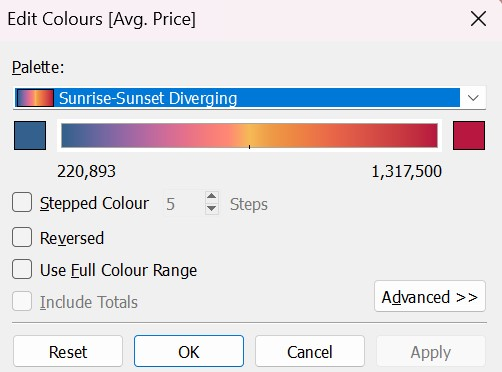
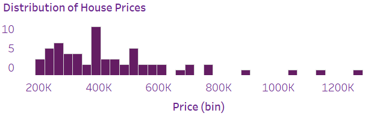
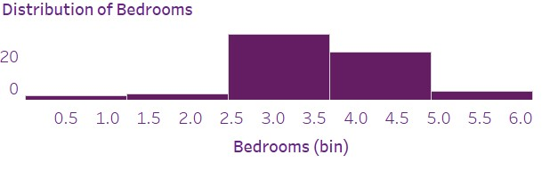
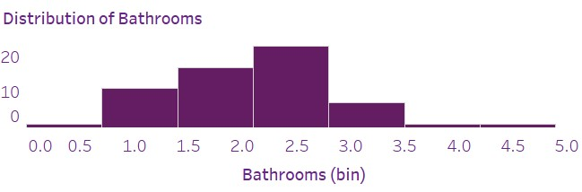
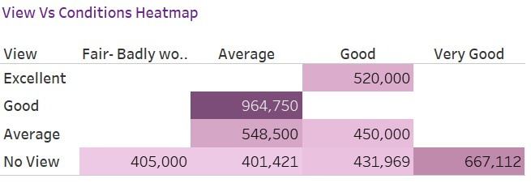

# Tableau-Projects
## King County Washington House Sales Analysis

## Introduction
The focus of this project is to analyze the house sales of the King County area in Washinbgton DC. The dataset I used was extracted from [Kaggle](https://www.kaggle.com/datasets/andykrause/kingcountysales). This dataset encompasses a range of home characteristics, geographical information, and property change records accumulated over the past ten years. By combining historical data with current information during the cleaning and preparation process, it becomes possible to accurately pinpoint changes like renovations, demolitions, and new constructions. The dataset contains 21,061 records with 16 variables.
Here's the link to the dataset: [King County, Washington DC House Sales](https://www.kaggle.com/datasets/andykrause/kingcountysales). The dataset is a 2-year records of house sales in the County for the period of 2014 and 2015.

**_Disclaimer:_** _The dataset was extrated from **[kaggle](kaggle.com)**. The information provided in this document/website is for general informational purposes only. While we strive to keep the information up to date and correct, we make no representations or warranties of any kind, express or implied, about the completeness, accuracy, reliability, suitability, or availability with respect to the document/website or the information, products, services, or related graphics contained on the document/website for any purpose. Any reliance you place on such information is therefore strictly at your own risk._  

## Objective
The obbjective of this Project is have an indepth understanding of the house mortgate in the county, have knowledge of house price base on some predetermined features of the choice of house of a potential buyer. this information will provide an insight of the mortgage business in the county. Other objective of these are:

1. __Market Trends:__ to analyze and identify trends in the real estate market, such as fluctuations in property prices, supply and demand dynamics, and market hotspots.

2. __Investment Opportunities:__ Investors use house sales analysis to identify potentially lucrative investment opportunities. Understanding market trends and property values helps investors make informed decisions about buying, selling, or holding onto real estate assets.

3. __Risk Assessment:__ Analyzing house sales data allows for the assessment of risks associated with property investments. Factors such as market volatility, economic conditions, and regulatory changes can impact property values and investment returns.

4. __Policy Making:__ To understand the role Government agencies and policymakers use house sales analysis to formulate housing policies, urban planning strategies, and regulations. Understanding housing market dynamics helps policymakers address issues such as affordable housing, housing supply shortages, and property taxation.

5. __Real Estate Development:__ Developers rely on house sales analysis to identify locations for new construction projects, assess demand for different types of properties, and determine pricing strategies. Analysis of house sales data informs decisions throughout the development process, from land acquisition to project completion.

Overall, analyzing house sales data provides valuable insights into the real estate market, guiding various stakeholders in making informed decisions related to investments, policy-making, and development.

 ## Tools used
   1. **Microsoft Excel 365 version:** I used this tool to primarily conduct some cleansing procedures of the dataset.  
   2. **Tableau Desktop:** A business intelligence used in conducting some analysis, make visualizations, and create a resourceful dashboard with good interactive features.

## Skills & Concepts Demonstrated
1. __Filters__  
   - Calendar widget (Including dropdown menu by month)  
   - Sliders (Year Built, Square living, and Square lot) 
2. __Visualization__  
   - Line Chart (Daily Average House Sale Prices)  
   - Map (Average Price base area zipcode)  
   - Histograms (Distributions of Bedrooms, Bathrooms, and House Prices)  
   - Heatmap (Compares View and Condition)
3. __Dashboard__

## Problem Statement
- What is the average house price on month and daily daily basis?
- Which area in Washington recorded the highest average sale price in 2014 and 2015
- What is the distribution of bedroom, bathroom in the month of January 2015?
- What is the relationship between View and Condition of the house? Does it have an impact on the price of the property?

## Data Modelling
This is single file and it contains all necessary variables needed to analyze the data. In other word, this is our fact table.

You can interact with the report [here](https://public.tableau.com/app/profile/afeez.afolabi/viz/HouseSale-KingCountyWashingtonDC_17119324428440/KingCountyHouseSales?publish=yes)  

### Dashboard Deployment

Main Analysis: Answer to the Problem Statement
1.  **What is the average house price on month and daily daily basis?:** The main control panel of this visualization is at the top left of the dashboard which is the Calendar widget. To answer this question, select your month of interest from either 20214 or 2015. This interactively controls all other visuals of the chart such as the zipcode in the map, average monthly and daily sales of house in that zipcode.
   
2.  **Which area in Washington recorded the highest average sale price in 2014 and 2015?:** From the widget select your month and year of interest, and check your answer from the map. for example in June 20214, is **ZIPCODE 98039** with average house price of **$1,317,500** and the least average house price belong to **ZIPCODE 98168** with an average sale price **$220,893** Kindly note that the color scale used to scale the prices is the Sunrise-Sunset Diverging.
   
    

3. **What is the distribution of bedroom, bathroom in the month of January 2015?:** This refers to the distribution of bathroom, and bedroom base on the day, month, or year of interest. Notice that if a day selected from the Calendar widget, only the distribution of house prices, bedroom and bathroom will show as a day does nor necessarily determine a trend in the chart or have an impact on the map. If I select December from the Calendar widget dropdown, the whole chart changes however, if I select 23rd in the month of December, then distribution of house prices, bedroom and bathroom will react while displaying the result using distribution bars. For example, on the 23rd of December 2014, average house price ranges from $250k to $800k, the average bedroom ranges from 3 to 5, and bathroom ranging from 1 to 4.

4. **What is the relationship between View and Condition of the house? Does it have an impact on the price of the property?:** Here, we compare views and condition of the house.The view can be Excellent, Good, Average, or no view. Also, the condition can be Fair or badly worn, Average, Good, or Very Good.                                              

| Distribution of House Prices                                   | Distribution of Bedrooms                           
| -------------------------------------------------------------- | ------------------------------------------------------------ |
|                              |                           

| Distribution of Bathrooms                                      | View Vs Condition Heatmap                          
| -------------------------------------------------------------- | ------------------------------------------------------------ |
|                              |                           

